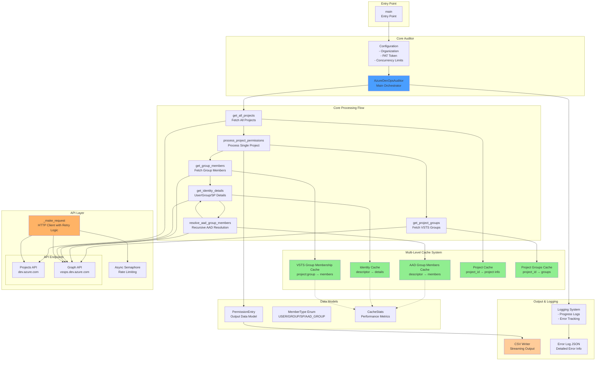
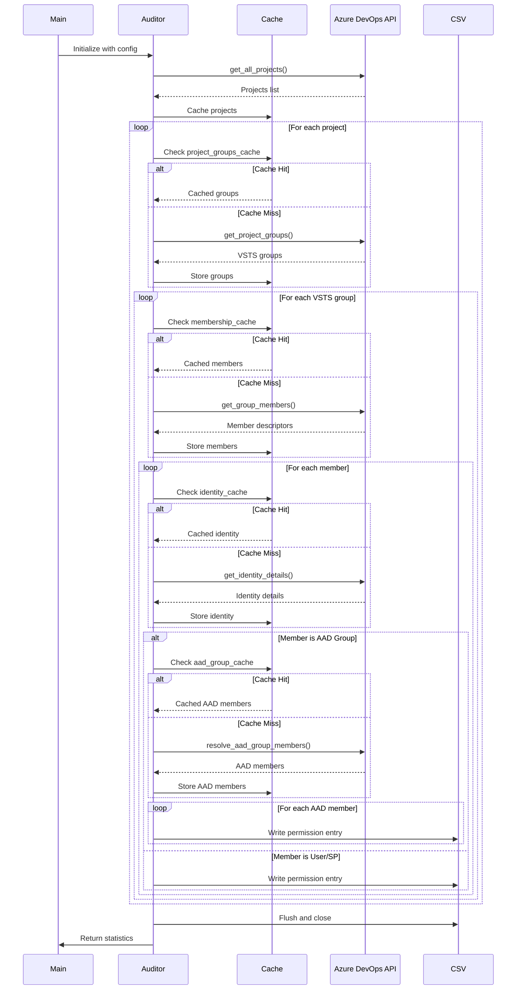
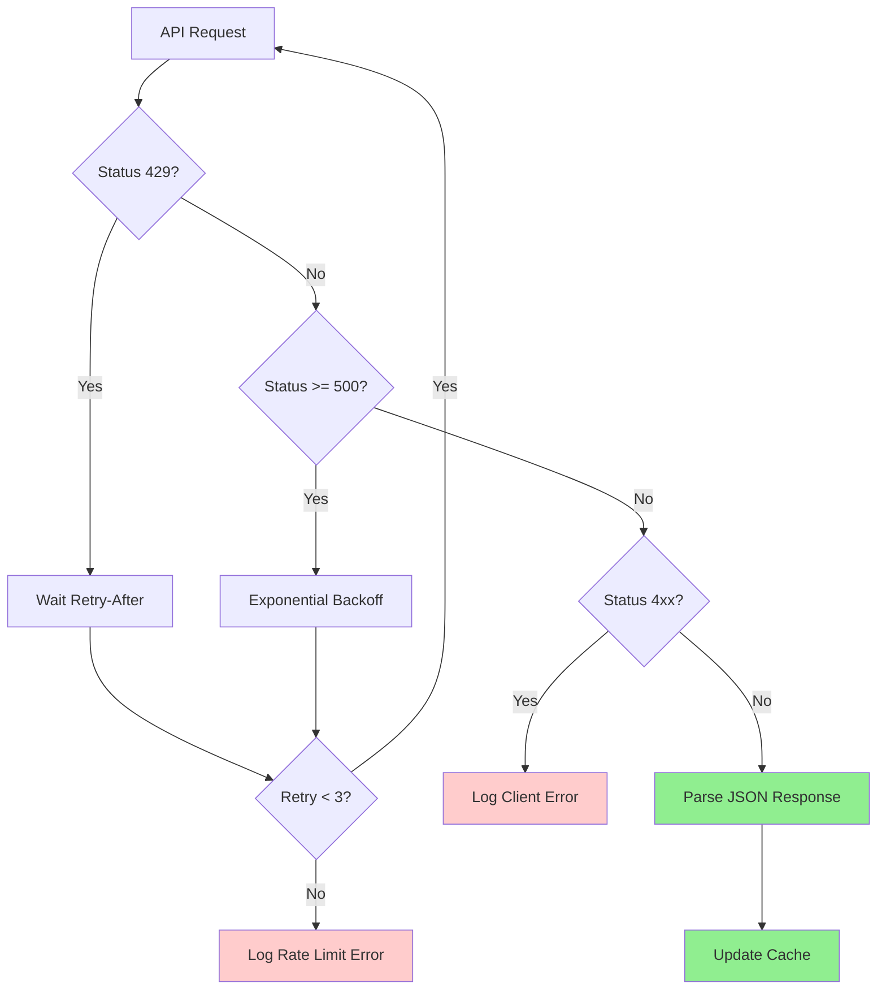
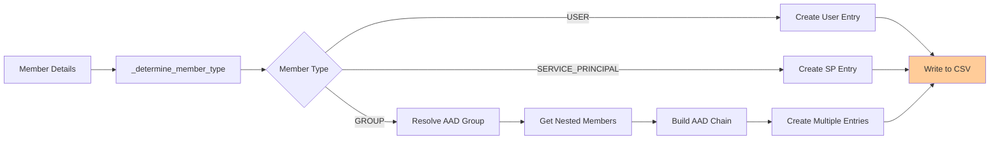
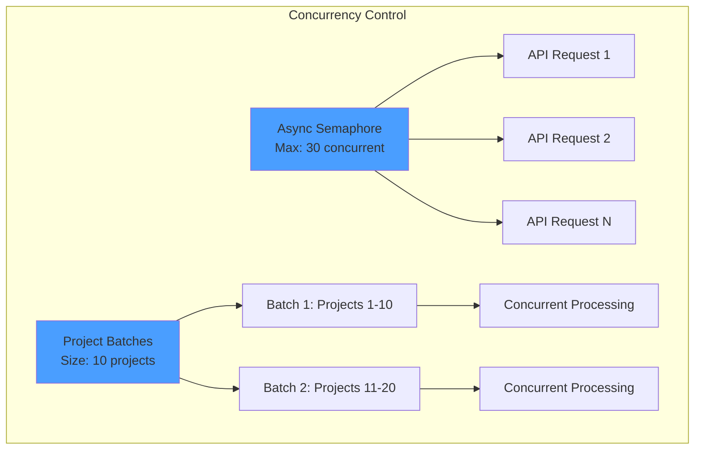
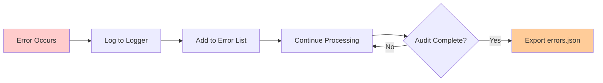

# Azure DevOps Permissions Auditor - Architecture

## System Overview

The Azure DevOps Permissions Auditor is an asynchronous Python application that efficiently audits user and service principal permissions across all projects in an Azure DevOps organization.

## Architecture Diagram



## Detailed Flow Diagram



## Component Details

### Core Components

#### AzureDevOpsAuditor
**Responsibilities:**
- Orchestrate the entire audit process
- Manage API connections and rate limiting
- Coordinate caching strategy
- Handle error tracking and logging

**Key Methods:**
- `run_audit()`: Main entry point for audit execution
- `process_project_permissions()`: Process single project with concurrency
- `get_identity_details()`: Fetch and cache identity information
- `resolve_aad_group_members()`: Recursively resolve nested AAD groups

#### Multi-Level Cache System

**Cache Hierarchy:**
1. **AAD Group Members Cache**: Stores resolved AAD group members to avoid re-resolution
2. **Identity Cache**: Stores user/group/SP details by descriptor
3. **VSTS Group Membership Cache**: Stores group memberships per project
4. **Project Cache**: Stores project information
5. **Project Groups Cache**: Stores VSTS groups per project

**Benefits:**
- Reduces API calls by 60-80% (typical cache hit rate)
- Prevents duplicate concurrent resolutions with async locks
- Handles circular AAD group references with cycle detection

### API Integration

#### Endpoint Strategy

```mermaid
graph LR
    subgraph "API Routing Logic"
        Descriptor{Descriptor Type?}
        Descriptor -->|vssgp.* or aadgp.*| GroupsAPI[/groups/ endpoint]
        Descriptor -->|aad.* or other| UsersAPI[/users/ endpoint]

        GroupType{Need Members?}
        GroupType -->|Yes| MembershipsAPI[/memberships/ endpoint<br/>direction=down]
        GroupType -->|No| GroupsAPI
    end

    style GroupsAPI fill:#90ee90
    style UsersAPI fill:#90ee90
    style MembershipsAPI fill:#90ee90
```

**Key Endpoints:**
- **Projects**: `dev.azure.com/{org}/_apis/projects`
- **Groups**: `vssps.dev.azure.com/{org}/_apis/graph/groups/{descriptor}`
- **Users**: `vssps.dev.azure.com/{org}/_apis/graph/users/{descriptor}`
- **Memberships**: `vssps.dev.azure.com/{org}/_apis/graph/memberships/{descriptor}?direction=down`

#### Error Handling Strategy



### Data Flow

#### Permission Entry Creation



## Performance Characteristics

### Concurrency Model



**Key Metrics:**
- **Max Concurrent Requests**: 30 (configurable)
- **Project Batch Size**: 10 projects per batch
- **Rate Limit Handling**: Automatic retry with exponential backoff
- **Cache Hit Rate**: Typically 60-80%

### Optimization Strategies

1. **Async Locks for AAD Groups**: Prevent duplicate concurrent resolutions of the same group
2. **Cycle Detection**: Prevent infinite loops in circular AAD group references
3. **Streaming CSV Output**: Memory-efficient output with periodic flushing
4. **Batch Processing**: Process projects in batches to manage memory and rate limits

## Error Tracking



**Error Categories:**
- `auth_error`: Authorization failures (401, 403)
- `client_error`: Client errors (400-499)
- `server_error`: Server errors (500+)
- `timeout`: Request timeouts
- `json_error`: JSON decode errors
- `unexpected_error`: Unhandled exceptions

## Output Format

### CSV Structure

| Field | Description |
|-------|-------------|
| `project_name` | Azure DevOps project name |
| `project_id` | Project GUID |
| `user_principal_name` | User/SP principal name |
| `user_display_name` | Display name |
| `user_id` | Origin ID or descriptor |
| `user_type` | USER/SERVICE_PRINCIPAL/GROUP/AAD_GROUP |
| `vsts_group_name` | VSTS security group name |
| `vsts_group_id` | VSTS group descriptor |
| `assignment_type` | 'direct' or group name |
| `assignment_group_type` | 'aad_group', 'vsts_group', or empty for direct |

### Example Output

```csv
project_name,project_id,user_principal_name,user_display_name,user_id,user_type,vsts_group_name,vsts_group_id,assignment_type,assignment_group_type
Main,abc-123,john@example.com,John Doe,xyz-789,user,Contributors,vssgp.XYZ,direct,
Main,abc-123,jane@example.com,Jane Smith,def-456,user,Readers,vssgp.ABC,DevTeam,aad_group
```

## Dependencies

- **aiohttp**: Async HTTP client for API requests
- **asyncio**: Async/await framework
- **csv**: CSV output writing
- **json**: JSON parsing and error export
- **base64**: PAT token encoding

## Configuration

### Environment Variables

- `ADO_ORGANIZATION`: Azure DevOps organization name
- `ADO_PAT_TOKEN`: Personal Access Token with read permissions

### Tunable Parameters

- `max_concurrent`: Maximum concurrent API requests (default: 30)
- `batch_size`: Projects per batch (default: 10)
- `max_retries`: API retry attempts (default: 3)
- `backoff_base`: Exponential backoff multiplier (default: 2)

## Key Design Decisions

### 1. Async Architecture
**Rationale**: Maximize throughput for I/O-bound API operations while respecting rate limits

### 2. Multi-Level Caching
**Rationale**: Minimize API calls and avoid duplicate work across projects with shared groups

### 3. Descriptor-Based Resolution
**Rationale**: Use graph descriptors instead of origin IDs for consistent API access across all entity types

### 4. Streaming CSV Output
**Rationale**: Memory-efficient output for large organizations with periodic flushing to prevent data loss

### 5. Recursive AAD Group Resolution
**Rationale**: Flatten nested AAD group structures to show actual user permissions with full chain visibility
